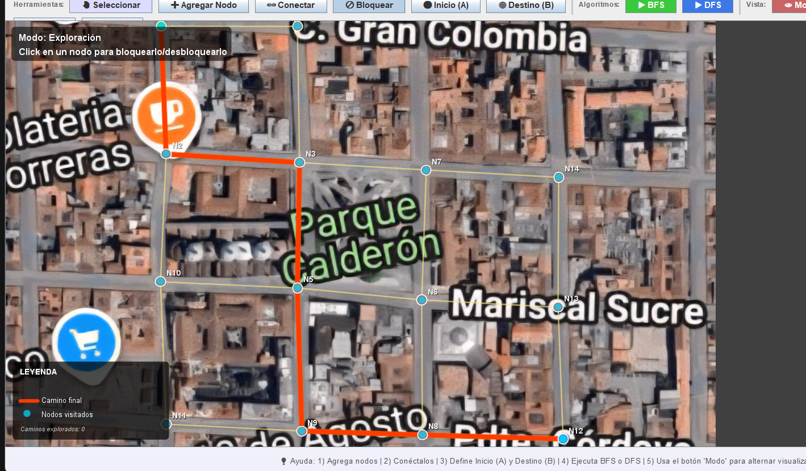
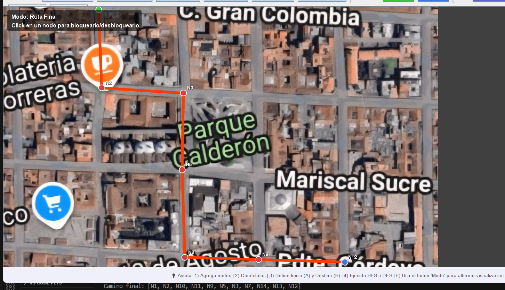
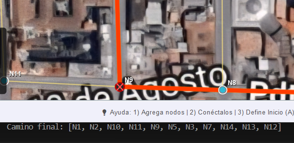
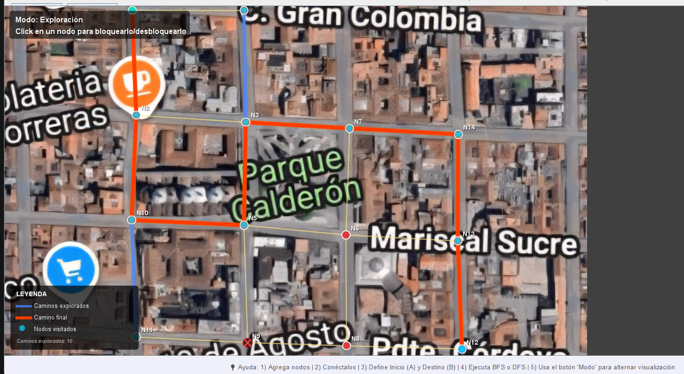

# Proyecto Final - Estructura de Datos
## Implementación de Algoritmos BFS y DFS para Encontrar Rutas Óptimas en Mapas

---

## 📋 Información del Proyecto

**Universidad:** Politécnica Salesiana  
**Asignatura:** Estructura de Datos – Segundo Interciclo  
**Práctica:** Proyecto Final  

**Integrantes:**
- Andrea Hurtado
- Juliana Torres 

**Docente:** Ing. Pablo Torres

---

## 📑 Índice

1. [Descripción del Problema](#descripción-del-problema)
2. [Propuesta de Solución](#propuesta-de-solución)
   - [Marco Teórico](#marco-teórico)
   - [Tecnologías Utilizadas](#tecnologías-utilizadas)
   - [Arquitectura del Sistema](#arquitectura-del-sistema)
   - [Estructura de Carpetas](#estructura-de-carpetas)
   - [Funcionamiento del Sistema](#funcionamiento-del-sistema)
3. [Capturas de Pantalla](#capturas-de-pantalla)
4. [Ejemplo de Código](#ejemplo-de-código)
5. [Conclusiones](#conclusiones)
6. [Recomendaciones](#recomendaciones)

---

## 🎯 Descripción del Problema

El proyecto consiste en desarrollar una aplicación gráfica interactiva que permita:

- **Modelar un mapa de calles** como un grafo sobre una imagen de fondo
- **Definir nodos manualmente** que representen intersecciones en el mapa
- **Conectar nodos mediante aristas** que representen las calles
- **Implementar algoritmos de búsqueda** (BFS y DFS) para encontrar rutas
- **Visualizar los recorridos** de forma clara y comprensible
- **Comparar el comportamiento** de ambos algoritmos

### Objetivos Específicos

1. Aplicar correctamente los algoritmos BFS (Breadth-First Search) y DFS (Depth-First Search)
2. Utilizar estructuras de datos adecuadas (Queue, Stack, Set, Map)
3. Implementar el patrón MVC (Modelo-Vista-Controlador)
4. Persistir la configuración del grafo en archivos
5. Medir y comparar tiempos de ejecución

---

## 💡 Propuesta de Solución

### Marco Teórico

#### Grafos

Un **grafo** es una estructura de datos que consiste en un conjunto de vértices (nodos) y un conjunto de aristas que conectan pares de vértices. En este proyecto:

- **Nodos:** Representan intersecciones en el mapa
- **Aristas:** Representan calles que conectan intersecciones
- **Grafo no dirigido:** Las conexiones son bidireccionales

#### BFS (Breadth-First Search)

**Búsqueda en Anchura** es un algoritmo que explora el grafo nivel por nivel:

- Utiliza una **Queue (Cola)** como estructura auxiliar
- Explora todos los vecinos de un nodo antes de pasar al siguiente nivel
- **Garantiza el camino más corto** en grafos no ponderados
- Complejidad temporal: O(V + E) donde V = vértices, E = aristas

**Características:**
- Exploración sistemática por niveles
- Camino más corto en número de aristas
- Mayor uso de memoria (almacena todos los nodos de un nivel)

#### DFS (Depth-First Search)

**Búsqueda en Profundidad** explora el grafo siguiendo una rama hasta el final antes de retroceder:

- Utiliza **recursividad** o una **Stack (Pila)**
- Explora en profundidad antes de explorar en anchura
- No garantiza el camino más corto
- Complejidad temporal: O(V + E)

**Características:**
- Exploración en profundidad con backtracking
- Menor uso de memoria (solo rama actual)
- Útil para encontrar cualquier camino

### Tecnologías Utilizadas

- **Lenguaje:** Java 17+
- **GUI:** Swing (javax.swing)
- **Gráficos:** Java 2D API (Graphics2D)
- **Estructuras de Datos:** Collections Framework
  - `LinkedHashMap` - Almacenar nodos y adyacencias
  - `LinkedHashSet` - Mantener orden de visita
  - `ArrayDeque` - Queue para BFS
  - `ArrayList` - Listas dinámicas
- **Patrón de Diseño:** MVC (Modelo-Vista-Controlador)
- **Persistencia:** Archivos de texto (.cfg)
- **Control de Versiones:** Git & GitHub

### Arquitectura del Sistema

El proyecto implementa el **patrón MVC**:

```
┌─────────────────────────────────────────┐
│            VISTA (View)                 │
│  - MainFrame                            │
│  - MapPanel (visualización)             │
│  - Toolbar (controles)                  │
│  - TimeStatsDialog                      │
└──────────────┬──────────────────────────┘
               │
               ↓
┌─────────────────────────────────────────┐
│        CONTROLADOR (Controller)         │
│  - MapController                        │
│    • Maneja eventos del usuario         │
│    • Coordina Modelo y Vista            │
│    • Ejecuta algoritmos                 │
└──────────────┬──────────────────────────┘
               │
               ↓
┌─────────────────────────────────────────┐
│           MODELO (Model)                │
│  - Graph (estructura del grafo)         │
│  - Node (nodos)                         │
│  - Algorithms (BFS & DFS)               │
│  - SearchResult (resultados)            │
│  - GraphIO (persistencia)               │
│  - TimeStats (estadísticas)             │
└─────────────────────────────────────────┘
```

**Diagrama UML Simplificado:**

```
┌──────────────┐         ┌──────────────┐
│    Graph     │◆───────▶│     Node     │
├──────────────┤         ├──────────────┤
│ nodes: Map   │         │ id: String   │
│ adj: Map     │         │ x, y: int    │
│ start: String│         │ blocked: bool│
│ end: String  │         └──────────────┘
├──────────────┤
│ addNode()    │         ┌──────────────┐
│ connect()    │         │  Algorithms  │
│ setBlocked() │         ├──────────────┤
└──────────────┘         │ bfs()        │
                         │ dfs()        │
                         └──────────────┘
```

### Estructura de Carpetas

```
proyecto-final/
├── src/
│   ├── controller/
│   │   └── MapController.java
│   ├── model/
│   │   ├── Algorithms.java
│   │   ├── Graph.java
│   │   ├── GraphIO.java
│   │   ├── Node.java
│   │   ├── SearchResult.java
│   │   └── TimeStats.java
│   ├── view/
│   │   ├── MainFrame.java
│   │   ├── MapPanel.java
│   │   ├── Toolbar.java
│   │   ├── TimeStatsDialog.java
│   │   └── VisualizationMode.java
│   └── App.java
├── data/
│   ├── mapa.cfg          # Configuración del grafo
│   └── times.csv         # Registro de tiempos
├── images/
│   └── mapa.png          # Imagen de fondo
└── README.md
```

### Funcionamiento del Sistema

#### 1. Carga de Configuración

Al iniciar, el sistema:
- Verifica si existe `data/mapa.cfg`
- Carga nodos, conexiones y configuración guardada
- Si no existe, carga solo la imagen de fondo

#### 2. Creación del Grafo

El usuario puede:
- **Agregar Nodos:** Click en el mapa con herramienta "Agregar Nodo"
- **Conectar Nodos:** Seleccionar dos nodos para crear una arista
- **Bloquear Nodos:** Marcar nodos como no transitables
- **Mover Nodos:** Arrastrar nodos con herramienta "Seleccionar"
- **Definir Inicio/Destino:** Marcar puntos A y B

#### 3. Ejecución de Algoritmos

**BFS:**
1. Se ejecuta desde el nodo inicial
2. Explora por niveles
3. Marca nodos visitados
4. Reconstruye el camino más corto

**DFS:**
1. Se ejecuta desde el nodo inicial
2. Explora en profundidad
3. Usa backtracking
4. Encuentra un camino válido

#### 4. Visualización

**Modo Exploración:**
- Muestra todos los nodos visitados
- Aristas exploradas en azul (DFS)
- Camino final en naranja brillante
- Puntos azules en nodos visitados

**Modo Ruta Final:**
- Solo muestra el camino definitivo
- Nodos inicio (verde) y destino (azul)
- Camino en naranja

#### 5. Estadísticas

- Registro de tiempos de ejecución
- Comparación BFS vs DFS
- Exportación a CSV
- Historial completo

---

## 📸 Capturas de Pantalla

### Configuración 1: Mapa Urbano Simple


*Modo Exploración mostrando todos los nodos visitados por BFS*


*Modo Ruta Final mostrando solo el camino definitivo*

### Configuración 2: Mapa Complejo con Bloqueos


*Grafo con nodos bloqueados (negro) que los algoritmos deben evitar*


*DFS mostrando caminos explorados (azul) y ruta final (naranja)*

### Estadísticas de Tiempo


*Ventana de estadísticas mostrando comparación BFS vs DFS*

---

## 💻 Ejemplo de Código

### Implementación de BFS

```java
/**
 * Búsqueda en Anchura (BFS)
 * Encuentra el camino más corto en un grafo no ponderado
 * 
 * @param g Grafo donde realizar la búsqueda
 * @param start Nodo de inicio
 * @param end Nodo destino
 * @return SearchResult con el camino encontrado y nodos visitados
 */
public static SearchResult bfs(Graph g, String start, String end) {
    // Validar parámetros y nodos bloqueados
    if (start == null || end == null) 
        return new SearchResult(List.of(), List.of(), List.of(), "BFS");
    
    Node startNode = g.getNode(start);
    Node endNode = g.getNode(end);
    if (startNode == null || endNode == null || 
        startNode.blocked || endNode.blocked) {
        return new SearchResult(List.of(), List.of(), List.of(), "BFS");
    }
    
    // Estructuras de datos para BFS
    Queue<String> queue = new ArrayDeque<>();      // Cola FIFO
    Map<String, String> parent = new HashMap<>();  // Reconstruir camino
    Set<String> visited = new LinkedHashSet<>();   // Nodos visitados (orden)
    
    // Inicializar con nodo de inicio
    queue.add(start);
    visited.add(start);

    // Explorar por niveles
    while (!queue.isEmpty()) {
        String current = queue.poll();  // Obtener siguiente nodo
        
        if (current.equals(end)) break; // Destino encontrado
        
        // Explorar vecinos
        for (String neighbor : g.getAdjacency().getOrDefault(current, Set.of())) {
            Node neighborNode = g.getNode(neighbor);
            
            // Verificar si el vecino es válido y no visitado
            if (neighborNode != null && 
                !neighborNode.blocked && 
                !visited.contains(neighbor)) {
                
                visited.add(neighbor);        // Marcar como visitado
                parent.put(neighbor, current); // Guardar predecesor
                queue.add(neighbor);           // Agregar a la cola
            }
        }
    }

    // Reconstruir camino desde destino hasta inicio
    List<String> path = reconstruct(parent, start, end);
    
    return new SearchResult(path, new ArrayList<>(visited), List.of(), "BFS");
}
```

**Explicación del código:**

1. **Validación:** Verifica que los nodos existan y no estén bloqueados
2. **Inicialización:** 
   - `Queue` para exploración FIFO
   - `Map` para rastrear predecesores
   - `Set` para marcar visitados
3. **Exploración:** 
   - Extrae nodo de la cola
   - Explora todos sus vecinos
   - Marca vecinos válidos como visitados
4. **Reconstrucción:** Usa el mapa de predecesores para obtener el camino

### Reconstrucción del Camino

```java
/**
 * Reconstruye el camino desde inicio hasta destino
 * usando el mapa de predecesores
 */
private static List<String> reconstruct(Map<String, String> parent, 
                                       String start, String end) {
    if (start.equals(end)) return List.of(start);
    
    List<String> path = new ArrayList<>();
    String current = end;
    
    // Retroceder desde destino hasta inicio
    while (current != null && !current.equals(start)) {
        path.add(current);
        current = parent.get(current);
    }
    
    if (current == null) return List.of(); // No hay camino
    
    path.add(start);
    Collections.reverse(path);  // Invertir para obtener inicio → destino
    
    return path;
}
```

---

## 📊 Conclusiones

#### Análisis Comparativo BFS vs DFS

Tras implementar y probar ambos algoritmos, he observado las siguientes diferencias:

**BFS (Breadth-First Search):**
- ✅ **Ventaja:** Garantiza el camino más corto en número de aristas
- ✅ **Exploración sistemática:** Nivel por nivel, predecible
- ❌ **Desventaja:** Mayor uso de memoria (almacena todo un nivel)
- 🎯 **Mejor para:** Encontrar la ruta más corta, navegación GPS

**DFS (Depth-First Search):**
- ✅ **Ventaja:** Menor uso de memoria (solo rama actual)
- ✅ **Implementación:** Más simple con recursividad
- ❌ **Desventaja:** No garantiza el camino óptimo
- 🎯 **Mejor para:** Detectar ciclos, exploración exhaustiva

#### Determinación del Algoritmo Más Adecuado

**Para este proyecto de mapas de calles:**

El algoritmo **BFS es más adecuado** porque:

1. **Optimización de rutas:** En mapas urbanos queremos el camino más corto
2. **Previsibilidad:** Los usuarios esperan rutas directas
3. **Uniformidad:** Todas las calles tienen peso similar (sin ponderar)

**Sin embargo, DFS tiene valor en:**
- Análisis de conectividad del grafo
- Encontrar "cualquier" camino rápidamente
- Exploración de todas las posibilidades

#### Aprendizajes Clave

1. La elección del algoritmo depende del **objetivo específico**
2. Las estructuras de datos (Queue vs Stack) definen el comportamiento
3. La visualización ayuda enormemente a comprender los algoritmos
4. El patrón MVC facilita la organización y mantenimiento del código

---

#### Observaciones Técnicas

Durante el desarrollo identifiqué aspectos importantes:

**Estructuras de Datos:**
- `LinkedHashSet` preserva el orden de inserción, vital para visualización
- `ArrayDeque` es más eficiente que `LinkedList` para Queue
- `HashMap` permite O(1) en búsqueda de predecesores

**Complejidad Temporal:**
Ambos algoritmos tienen O(V + E), pero en la práctica:
- BFS tiende a ser más consistente
- DFS puede ser más rápido si el destino está cerca en profundidad

**Optimizaciones Implementadas:**
1. Detección temprana al encontrar destino
2. Verificación de nodos bloqueados antes de agregar a estructuras
3. Uso de Set para evitar revisitas (O(1) vs O(n))

#### Aplicabilidad Real

Este sistema tiene aplicaciones prácticas en:

1. **Sistemas de Navegación:** GPS, aplicaciones de mapas
2. **Logística:** Optimización de rutas de entrega
3. **Redes:** Enrutamiento de paquetes, análisis de topología
4. **Juegos:** Pathfinding para NPCs
5. **Urbanism:** Planificación de transporte público

---

## 🔗 Repositorio

**GitHub:** https://github.com/andrea-hurtado/icc-est-u3-proyecto-final.git

---

**Fecha de entrega:** [9/2/2026]